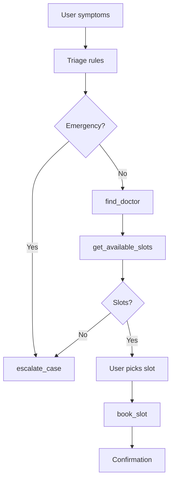

# Health Agent

A beginner-friendly **full-stack Python demo** that simulates an AI healthcare appointment booking and triage assistant. Built for internship portfolios and GitHub — no databases, Docker, or heavy frameworks.

> **Disclaimer:** This project is for education and demonstration only. It does **not** provide real medical advice. For emergencies, contact your local emergency number immediately.

## Features

| Module | Description |
|--------|-------------|
| **Symptom triage** | Rule-based specialty detection and risk levels (Low / Medium / High) |
| **Appointment booking** | Find doctors, list slots from JSON, book appointments |
| **Tool functions** | Modular `find_doctor`, `get_available_slots`, `book_slot`, `escalate_case` |
| **Human escalation** | Emergency symptoms, no slots, or uncertain routing |

## Tech stack

- Python 3.10+
- [Streamlit](https://streamlit.io/) UI
- JSON file storage (`data/doctors.json`, `data/slots.json`)

## Project structure

```
health-agent/
├── app.py                      # Streamlit UI entry point
├── agents/
│   └── booking_agent.py        # Triage + booking workflow orchestration
├── tools/
│   └── hospital_tools.py       # Tool functions (doctor, slots, book, escalate)
├── prompts/
│   └── triage_prompt.txt       # Triage assistant guidelines (reference text)
├── data/
│   ├── doctors.json            # Sample doctor records
│   └── slots.json              # Sample appointment slots
├── README.md
└── requirements.txt
```

## Quick start

### 1. Clone or download

```bash
git clone https://github.com/DeekshaNemivant/health-agent.git
cd health-agent
```

### 2. Create a virtual environment (recommended)

```bash
python -m venv venv

# Windows
venv\Scripts\activate

# macOS / Linux
source venv/bin/activate
```

### 3. Install dependencies

```bash
pip install -r requirements.txt
```

### 4. Run the app

```bash
streamlit run app.py
```

Open the URL shown in the terminal (usually `http://localhost:8501`).

## How to use the demo

1. Enter symptoms (e.g. `chest pain`, `fever`, `skin rash`).
2. Optionally pick a specialty or leave **Auto-detect**.
3. Choose a preferred date — sample dates with slots: `2026-06-02`, `2026-06-03`, `2026-06-04`.
4. Click **Run Health Agent**.
5. If slots are available, click **Book** on a time slot to confirm.

### Example symptom mappings

| Symptoms | Specialty | Risk |
|----------|-----------|------|
| chest pain | cardiologist | High |
| fever, cough | general physician | Medium |
| skin rash, itching | dermatologist | Low |
| difficulty breathing | — | Escalation (emergency) |

## Tool functions

Defined in `tools/hospital_tools.py`:

```python
find_doctor(specialty)           # Returns first matching doctor
get_available_slots(date)        # Unbooked slots for a date
book_slot(slot_id)               # Marks slot as booked in JSON
escalate_case(reason, summary)   # Returns escalation payload
```

## Escalation triggers

The agent escalates to a human coordinator when:

- Emergency keywords are detected (e.g. difficulty breathing)
- No doctor exists for the requested specialty
- No appointment slots are available on the chosen date
- Symptoms cannot be mapped to a specialty (uncertain routing)

Escalation output includes **reason** and **conversation summary**.

## Customizing data

Edit `data/doctors.json` and `data/slots.json` to add doctors or slots. After booking, `slots.json` is updated in place (`booked: true`).

To reset bookings, set `"booked": false` on slots manually or restore from git.

## Architecture (simple agent flow)



## Portfolio tips

- Link this repo on your resume with a one-line description of the agent workflow.
- Mention: rule-based triage, tool-style functions, JSON persistence, Streamlit UI.
- Optional follow-ups: add unit tests, logging, or a simple REST API layer.

## License

MIT — free to use and modify for learning and portfolio purposes.
